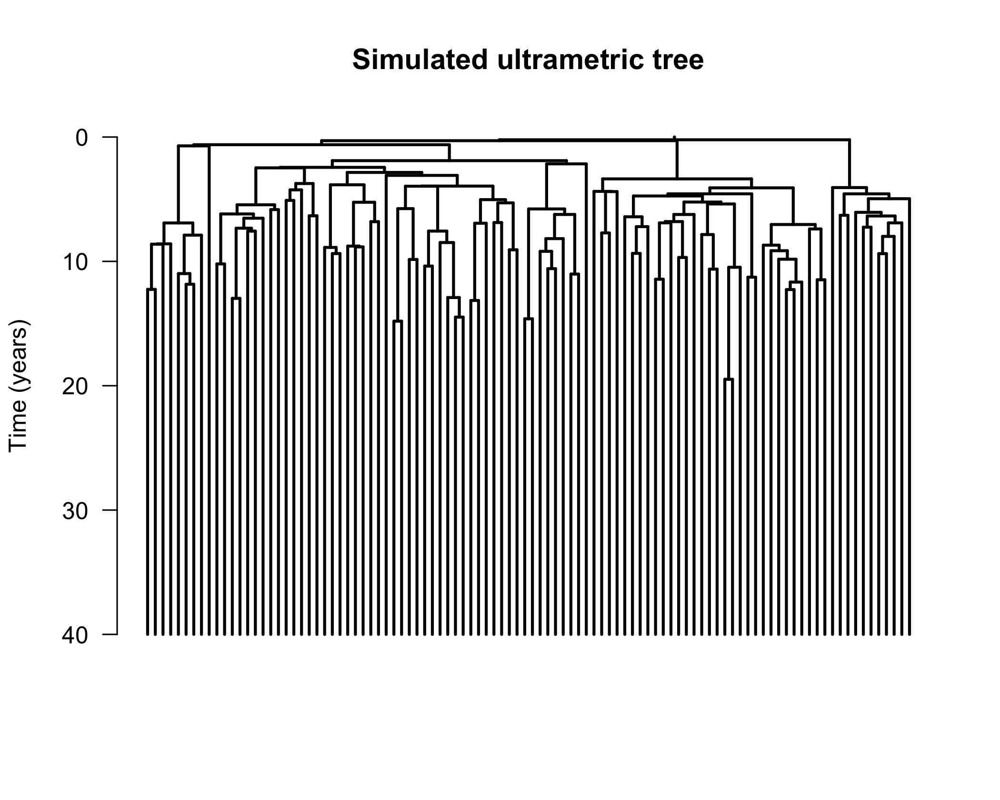
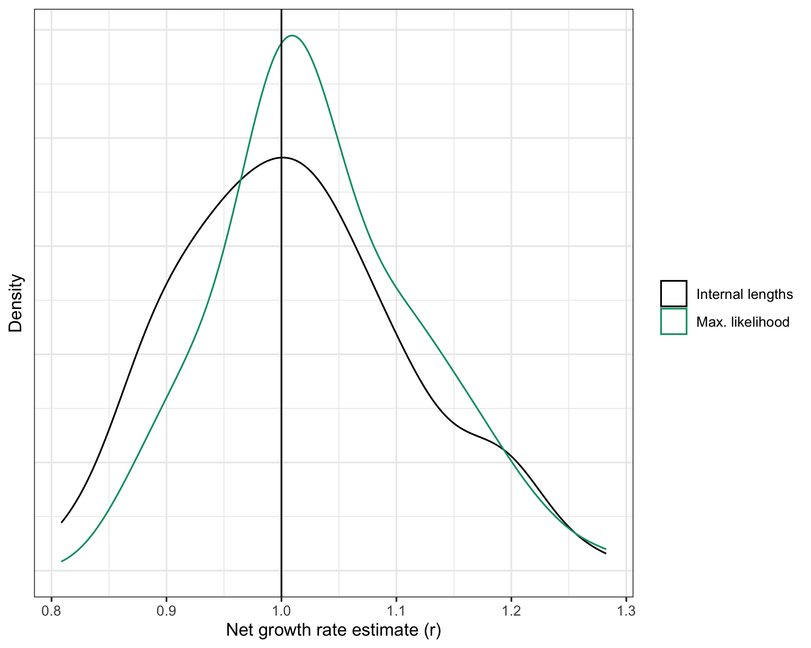

<!-- README.md is generated from README.Rmd. Please edit that file -->

# cloneRate <a href="https://bdj34.github.io/cloneRate/"></a>

<!-- badges: start -->

[](https://github.com/bdj34/cloneRate/actions/workflows/R-CMD-check.yaml)
[](https://app.codecov.io/gh/bdj34/cloneRate?branch=main)
<!-- badges: end -->

The goal of cloneRate is to provide easily accessible methods for
estimating the growth rate of clones. The input should either be an
ultrametric phylogenetic tree with edge lengths corresponding to time,
or a non-ultrametric phylogenetic tree with edge lengths corresponding
to mutation counts. This package provides the internal lengths and
maximum likelihood methods for ultrametric trees and the shared
mutations method for mutation-based trees, all of which are from our
recent paper [cloneRate: fast estimation of single-cell clonal dynamics
using coalescent
theory](https://academic.oup.com/bioinformatics/advance-article/doi/10.1093/bioinformatics/btad561/7271182).
We also provide a birth-death Markov Chain Monte Carlo (MCMC) approach
using the probability density derived in Eq. 5 of [Tanja Stadler’s
work](https://pubmed.ncbi.nlm.nih.gov/19631666/).

To test our methods, we provide a fast way to simulate the coalescent
(tree) of a sample from a birth-death branching process, which is a
direct result of [Amaury Lambert’s
work](https://pubmed.ncbi.nlm.nih.gov/29704514/).

## Installation

Install from CRAN with the following:

``` r
install.packages("cloneRate")
```

Alternatively, you can install the development version of cloneRate from
[GitHub](https://github.com/). For this basic tutorial and our
vignettes, we will also use a few other packages, which can all be
installed from CRAN. Because these are listed as packages we ‘suggest’,
running the following command (with `dependencies = TRUE`) will install
them along with the vignettes:

``` r
# Install devtools if you don't have it already
install.packages(setdiff("devtools", rownames(installed.packages())))

# Install
devtools::install_github("bdj34/cloneRate", build_vignettes = TRUE, dependencies = TRUE)
```

Alternatively, you can install them manually:

``` r
install.packages(setdiff(c("ggplot2", "ggsurvfit", "survival", "car"), rownames(installed.packages())))
```

## Example

We’ll walk through simulating a single tree and plotting it. Then we’ll
apply our growth rate methods.

### Simulate data

We can simulate a sample of size n from a birth-death tree as follows:

``` r
library(cloneRate)
library(ape)
library(ggplot2)

# Generate a sampled tree with 100 tips from a 20 year birth-death process with birth rate a=1 and death rate b=0.5
tree <- simUltra(a = 1, b = 0.5, cloneAge = 40, n = 100)
```

Now that we have simulated the tree, let’s plot it:

``` r
# Plot, then add scale and title
plot.phylo(tree,
  direction = "downwards",
  show.tip.label = FALSE, edge.width = 2
)
axisPhylo(side = 2, backward = FALSE, las = 1)
title(main = "Simulated ultrametric tree", ylab = "Time (years)")
```



### Estimate growth rate of one tree

We can use this tree as input to our methods for growth rate estimation:

``` r
# Estimate the growth rate r=a-b=0.5 using maximum likelihood
maxLike.df <- maxLikelihood(tree)
print(paste0("Max. likelihood estimate = ", round(maxLike.df$estimate, 3)))
#> [1] "Max. likelihood estimate = 0.537"

# Estimate the growth rate r=a-b=0.5 using internal lengths
intLengths.df <- internalLengths(tree)
print(paste0("Internal lengths estimate = ", round(intLengths.df$estimate, 3)))
#> [1] "Internal lengths estimate = 0.527"
```

Because we’re simulating a new tree each time, the estimate will change
with each run, so don’t be worried if your results don’t match exactly.

### Estimate growth rate of many trees

In [our
paper](https://academic.oup.com/bioinformatics/advance-article/doi/10.1093/bioinformatics/btad561/7271182),
we use simulated trees to test our growth rate estimates. As an example,
let’s load some simulated data that comes with our package,
`exampleUltraTrees` has 100 ultrametric trees. In the “metadata”
data.frame we will find the ground truth growth rate, which in this case
is 1. Let’s apply our methods to all 100 trees.

``` r
# Here we are applying two methods to all of the ultrametric trees
resultsUltraMaxLike <- maxLikelihood(exampleUltraTrees)
resultsUltraLengths <- internalLengths(exampleUltraTrees)
```

Notice how the functions `maxLikelihood()` and `internalLengths()` can
take as input either a single tree or a list of trees. Either way, the
output is a `data.frame` containing the results. Now that we have 100
estimates on 100 different trees from 2 different methods, let’s plot
the distributions

``` r
# Combine all into one df for plotting. This works because the columns are the same
resultsCombined <- rbind(resultsUltraMaxLike, resultsUltraLengths)

# Plot, adding a vertical line at r=1 because that's the true growth rate
ggplot(resultsCombined) +
  geom_density(aes(x = estimate, color = method), linewidth = 1.5) +
  geom_vline(xintercept = exampleUltraTrees[[1]]$metadata$r) +
  theme_bw() +
  theme(
    axis.text.y = element_blank(), axis.ticks.y = element_blank(),
    legend.title = element_blank()
  ) +
  xlab("Net growth rate estimate (r)") +
  ylab("Density") +
  scale_color_manual(labels = c("Internal lengths", "Max. likelihood"), values = c("black", "#009E73"))
```



Finally, let’s compute the root mean square error (RMSE) of the
estimates. We expect maximum likelihood to perform the best by RMSE, but
100 is a relatively small sample size so anything could happen…

``` r
# Calculate the RMSE
groundTruth <- exampleUltraTrees[[1]]$metadata$r[1]
rmse <- unlist(lapply(
  split(resultsCombined, resultsCombined$method),
  function(x) {
    sqrt(sum((x$estimate - groundTruth)^2) / length(x$estimate))
  }
))

print(rmse)
#>    lengths    maxLike 
#> 0.09119116 0.08756432
```

As expected, maximum likelihood performs the best. Note that this may
change if we regenerate the data. For more details, see the [cloneRate
website](https://bdj34.github.io/cloneRate/) or vignettes:

``` r
vignette("cloneRate-dataAnalysis", package = "cloneRate")
vignette("cloneRate-simulate", package = "cloneRate")
```

## References

Simulating the birth-death trees is a direct result of the work of
Amaury Lambert in:

- [Lambert, 2018](https://pubmed.ncbi.nlm.nih.gov/29704514/)

Our package comes with 42 clones annotated from four distinct
publications, which are the ones we use in our analysis. Note that there
are three clones profiled at two different timepoints, meaning there are
39 unique clones. The papers which generate this data are:

- [Williams et al. 2022](https://pubmed.ncbi.nlm.nih.gov/35058638/)
- [Mitchell et al. 2022](https://pubmed.ncbi.nlm.nih.gov/35650442/)
- [Fabre et al. 2022](https://pubmed.ncbi.nlm.nih.gov/35650444/)
- [Van Egeren et al. 2021](https://pubmed.ncbi.nlm.nih.gov/33621486/)

The birth-death MCMC (not shown here) is based on the probability
density derived in Eq. 5 of Tanja Stadler’s work:

- [Stadler, 2009](https://pubmed.ncbi.nlm.nih.gov/19631666/)

The mathematical basis for our estimates is detailed in full in [our
paper](https://academic.oup.com/bioinformatics/advance-article/doi/10.1093/bioinformatics/btad561/7271182/).
